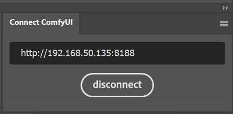

# SD-PPP: Photoshop Helper for ComfyUI

## How to use
1. Use ComfyManager to install `sd-ppp`

    

2. install Photoshop plugin
    1. by CXX:
        1. download `http://<your-comfy-url>/extensions/sd-ppp/sd-ppp_PS.ccx`.
        2. double click the `.ccx` file. Or place it into photoshop's plugin directory.
    2. by UXP develop Tool (you can debug the code this way):
        1. clone this repository
        2. [optionnal] run `npm install` and `npm build` in `photoshop` directory. (if you want to debug or modify the code)
        3. click `Add Plugin` in UXP Develop Tool by selecting `photoshop/dist/manifest.json`.

3. connect to comfyUI in Photoshop

    

4. add get/send node in ComfyUI

    

    > In the current version, each time you add/remove layers in Photoshop, you need to refresh the ComfyUI webpage to get the new layer names for selection.

### Thanks to 
AbdullahAlfaraj/Auto-Photoshop-StableDiffusion-Plugin
