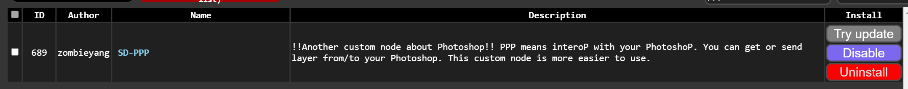
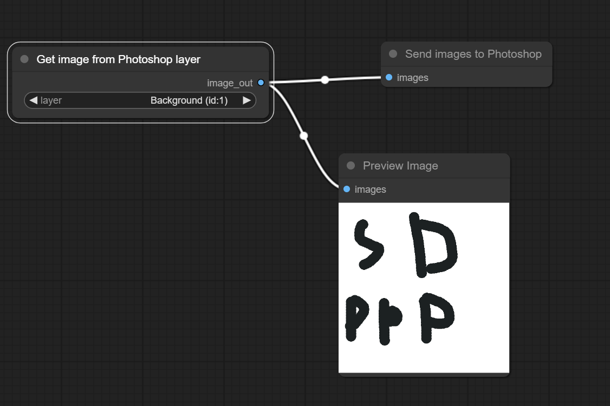

# SD-PPP: Easily use photoshop in your StableDiffusion/ComfyUI
> ppp for Professional Photoshop transPorter

this extension/custom_node is mainly focus on getting/sending picture from/to Photoshop in ComfyUI or SD

ComfyUI Showcase

    

SD/SDForge Showcase

    

    
## How to install

<b>ComfyUI</b>

1. Use [ComfyManager](https://github.com/ltdrdata/ComfyUI-Manager) to install `sd-ppp` or clone this repository into `<your-comfy-directory>/custom_nodes`

    

2. install Photoshop plugin
    1. by CCX:
        1. download `http://<your-comfy-url>/extensions/sd-ppp/plugins/sd-ppp_PS.ccx`.
           > for example: `http://127.0.0.1:8188/extensions/sd-ppp/plugins/sd-ppp_PS.ccx`
       
        3. double click the `.ccx` file. Or place it into photoshop's plugin directory.
    2. by UXP develop Tool (you can debug the code this way):
        1. clone this repository
        2. [optional] Run `npm install` and `npm build` in `photoshop` directory. (if you want to debug or modify the code)
        3. click `Add Plugin` in UXP Develop Tool by selecting `photoshop/dist/manifest.json`.

3. connect to comfyUI in Photoshop

    

   > If you cannot connect ComfyUI via `https`, use `http` instead

5. add get/send node in ComfyUI

    

<b>StableDiffusion or SD-Forge</b>

1. install in SD's `extension` tab or clone this repository into `<your-sd-directory>/extensions`
    

2. install Photoshop plugin
    1. by CCX:
        1. download `http://<your-sd-url>/file=extensions/sd-ppp/javascript/plugins/sd-ppp_PS.ccx`.
           > for example: `http://127.0.0.1:7860/file=extensions/sd-ppp/javascript/plugins/sd-ppp_PS.ccx`
        3. double click the `.ccx` file. Or place it into photoshop's plugin directory.
    2. by UXP develop Tool (you can debug the code this way):
        1. clone this repository
        2. [optional] Run `npm install` and `npm build` in `photoshop` directory. (if you want to debug or modify the code)
        3. click `Add Plugin` in UXP Develop Tool by selecting `photoshop/dist/manifest.json`.

4. connect to Stable diffusion in Photoshop

    

5. Select a specific layer to get pictures from Photoshop in any image element.

    1. 
    2. 
    3. 

6. select a specific layer to send pictures to Photoshop

    1. 

-----------------------------

### Ask for help
[Discord](https://discord.gg/5wmUQ3aZ)

### Concept
In contrast to the plugin that I contributed before [AbdullahAlfaraj/Auto-Photoshop-StableDiffusion-Plugin](https://github.com/AbdullahAlfaraj/Auto-Photoshop-StableDiffusion-Plugin), which "runs" the SD/Comfy in Photoshop. This tool provides another option that makes Photoshop a helper of SD/ComfyUI. Because I think SD/Comfy will keep growing fast in the future, it is hard to inject the entire SD/Comfy Ecology into Photoshop with a single plugin.

Still, shout out to AbdullahAlfaraj's plugin and I inherited some of the code using Photoshop's API in it.
